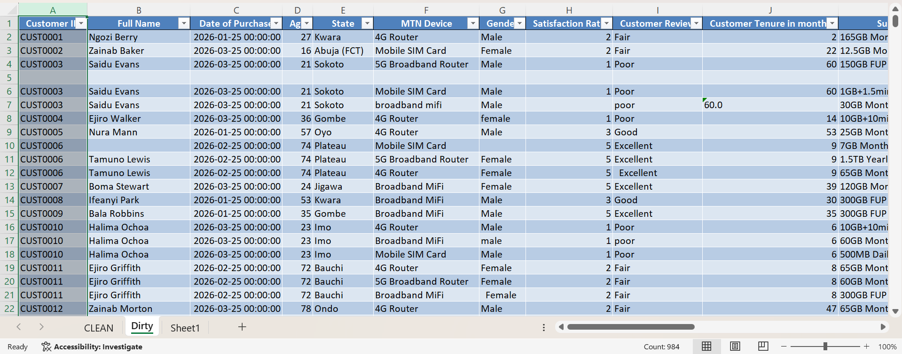
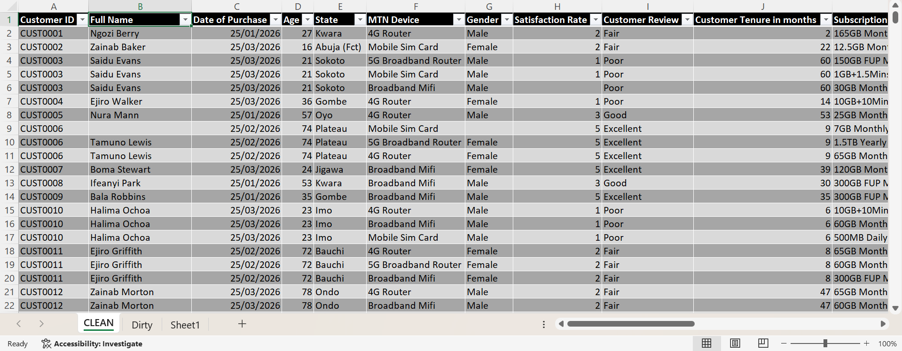

# Customer Data Cleaning & Quality Preparation

## Project Overview

This project focused on cleaning, validating, standardizing, and
preparing a customer dataset for reliable downstream analysis using
**Microsoft Excel Power Query**.

The goal was to create a clean, consistent, analysis-ready dataset while
preserving legitimate records and avoiding unsupported assumptions.

## Project Objectives

-   Identify data-quality issues
-   Remove completely blank records
-   Identify and remove exact duplicate records
-   Standardize inconsistent text formatting and spelling
-   Correct incorrect data types
-   Validate numerical and categorical fields
-   Investigate missing values responsibly
-   Preserve useful records containing missing information
-   Standardize subscription-plan names
-   Produce a reliable dataset ready for future analysis

## Tools Used

-   Microsoft Excel
-   Power Query

Power Query was used for data profiling, transformation, cleaning,
duplicate detection, missing-value investigation, data-type correction,
text standardization, and validation.

## Dataset Overview

The dataset contained **17 columns** and **988 records** at the stage
used for final row-count reconciliation.

The fields covered customer information, purchase information,
subscription information, satisfaction, usage, churn status, and churn
reasons.

Key issues included missing values, exact duplicates, inconsistent
capitalization and formatting, inconsistent subscription-plan notation,
and incorrect data types.

### Before Cleaning

## Data Cleaning Process
### Power Query Cleaning Process

### Customer ID

-   Blank values and inconsistent formatting were identified.
-   Spaces were removed and formatting standardized.
-   Repeated Customer IDs were not automatically deleted because a
    customer can legitimately have multiple records.
-   Exact duplicates were investigated separately.

### Completely Blank Records

-   **5 completely blank records** were identified and removed.

### Exact Duplicate Records

-   **9 exact duplicate records** were identified and removed after
    considering the complete row.
-   Repeated Customer IDs were not treated as duplicates by themselves.

### Text Standardization

Trim and Capitalize Each Word were applied where appropriate to fields
including Full Name, State, MTN Device, Gender, Customer Review, and
Churn Status.

Gender was standardized to **Male, Female, and null**.

Customer Review was standardized to **Excellent, Very Good, Good, Fair,
Poor, and null**.

### Subscription Plan

Actual plan names were preserved as separate products.

Replace Values was used to standardize: - `Gb` → `GB` - `Mb` → `MB` -
`Tb` → `TB` - `Fup` → `FUP`

Different plans were not merged because data volume, duration, broadband
classification, minutes, and FUP status can represent different
products.

### Data Types

-   Unit Price was changed to **Currency**.
-   Total Revenue was changed to **Currency**.
-   Other fields were reviewed and retained with appropriate data types.

### Validation

-   Satisfaction Rate was checked against the expected 1--5 rating
    scale.
-   No unrealistic ages were identified.
-   Data Usage was checked for negative or unrealistic values.
-   Missing values were investigated rather than automatically removed.

## Missing Value Strategy

A key principle throughout the project was:

> **Do not fabricate missing information.**

Records containing useful information were retained even when individual
fields were missing. Where no reliable replacement could be determined,
the field was left as **null**.

For example, 692 Reasons for Churn values were blank. Cross-checking
with Churn Status showed 685 records with `No`, 2 with `Yes`, and 5 with
`null`. No churn reasons were fabricated.

## Duplicate & Row Reduction Summary

  Action                            Records
  ------------------------------- ---------
  Initial records                       988
  Completely blank rows removed           5
  Exact duplicate rows removed            9
  **Final records**                 **974**

**988 − 5 − 9 = 974**

The final cleaned dataset contains **974 records across 17 columns**.

## Final Data Quality Validation

The Power Query Applied Steps were reviewed to ensure temporary
investigation filters were not restricting the final dataset.

The final Applied Step showed **974 rows**, confirming that the complete
cleaned dataset was retained.
### Final Clean Dataset

## Key Data Quality Improvements

-   Removed completely blank records
-   Removed exact duplicate records
-   Standardized text formatting and categorical values
-   Standardized subscription-plan notation
-   Corrected monetary data types
-   Validated satisfaction ratings and numerical fields
-   Investigated missing values rather than blindly deleting records
-   Preserved legitimate repeated customer records
-   Maintained a traceable Power Query transformation history

## Data Cleaning Principles Applied

1.  Preserve valid information.
2.  Do not fabricate missing data.
3.  Distinguish duplicates from legitimate repeated customer records.
4.  Standardize without changing the meaning of product plans.
5.  Validate before transforming.
6.  Maintain traceability through Applied Steps.

## Final Outcome

The final dataset contains **974 records and 17 columns** and has
undergone systematic data cleaning and quality preparation.

It is ready for downstream analysis, reporting, visualization, or
modeling.

## Skills Demonstrated

-   Excel Power Query
-   Data Cleaning
-   Data Quality Assessment
-   Missing Value Handling
-   Duplicate Detection
-   Data Validation
-   Data Standardization
-   Data Type Conversion
-   Categorical Data Cleaning
-   Text Transformation
-   Data Profiling
-   Data Documentation
-   Data Quality Decision-Making

## Conclusion

This project demonstrates practical use of **Excel Power Query for data
cleaning and quality preparation**.

The process focused on understanding the meaning and quality of the data
before making changes, rather than simply deleting missing or repeated
records.

**Project Result: 988 initial records → 974 clean records**

-   5 completely blank records removed
-   9 exact duplicate records removed
-   Legitimate records containing missing individual fields preserved
